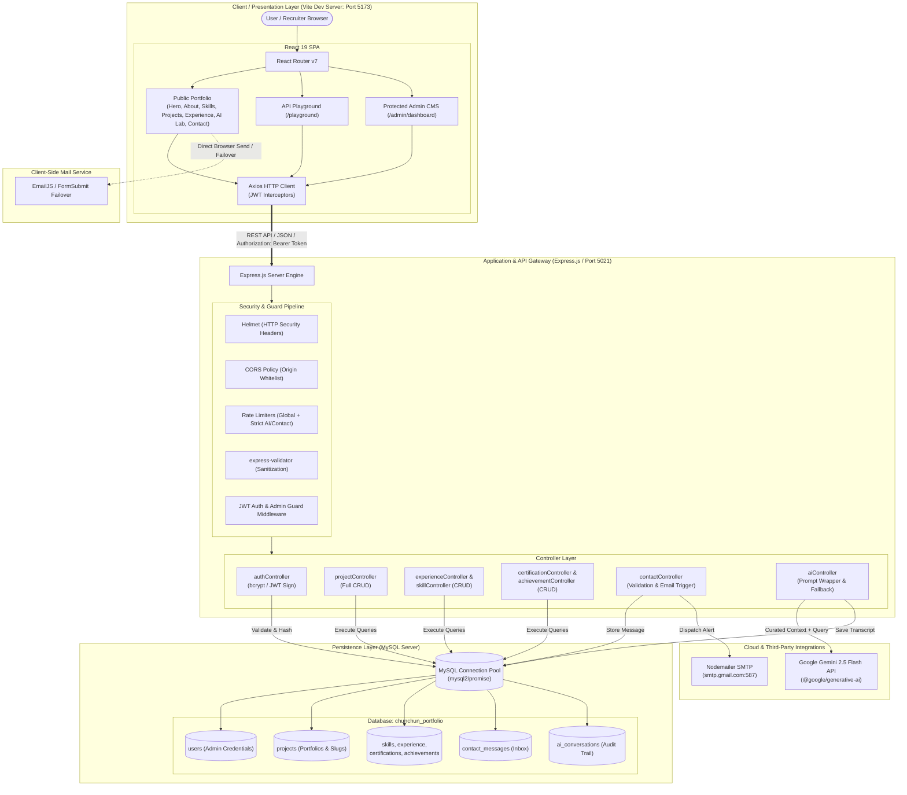

# 🚀 Chunchun Kumar Singh | Full Stack Developer Portfolio & AI Ecosystem

[](https://react.dev/)
[](https://vitejs.dev/)
[](https://tailwindcss.com/)
[](https://nodejs.org/)
[](https://expressjs.com/)
[](https://www.mysql.com/)
[](https://ai.google.dev/)
[](https://jwt.io/)

A modern, production-ready, full-stack portfolio and developer showcase for **Chunchun Kumar Singh** (Computer Science & Engineering graduate from Anna University). 

This platform combines a high-performance **React 19 SPA** with a secure **Node.js/Express REST API**, **MySQL relational persistence**, an interactive **Google Gemini 2.5 Flash AI Assistant**, a developer **API Playground**, and a **JWT-authenticated Admin Content Management Dashboard**.

---

## 📑 Table of Contents

- [Key Features](#-key-features)
- [System Architecture](#-system-architecture)
- [Tech Stack](#-tech-stack)
- [Directory Structure](#-directory-structure)
- [Getting Started & Local Setup](#-getting-started--local-setup)
  - [Prerequisites](#prerequisites)
  - [1. Database Configuration & Seeding](#1-database-configuration--seeding)
  - [2. Backend Setup](#2-backend-setup)
  - [3. Frontend Setup](#3-frontend-setup)
- [Environment Variables](#-environment-variables)
- [Admin Portal & Credentials](#-admin-portal--credentials)
- [API Reference](#-api-reference)
- [Email & SMTP Testing Utility](#-email--smtp-testing-utility)
- [Author & Contact](#-author--contact)

---

## ✨ Key Features

### 1. 🎨 Dynamic & High-Performance UI
- **Glassmorphic Cyber Aesthetics**: Custom dark palette (`#0b0f19`, `#0d1322`) with glowing neon accents (blue, cyan, purple).
- **Smooth Micro-Interactions**: Fluid animations and staggered reveal transitions powered by **Framer Motion**.
- **Interactive Architecture Diagram**: Embedded interactive data flow schemas demonstrating Full-Stack flow, JWT Auth flow, and Gemini AI integration.
- **Project Case Studies**: Rich modal and detail views showcasing live demos, GitHub repositories, and tech stacks.

### 2. 🤖 Chunchun AI Assistant (AI Lab)
- **Context-Grounded Virtual Assistant**: Powered by **Google Gemini 2.5 Flash** (`@google/generative-ai`), equipped with prompt-engineered context detailing Chunchun's skills, education, internships, and project metrics.
- **Persistent Conversation History**: Queries and AI responses are automatically recorded in the MySQL `ai_conversations` table for analytics and auditing.
- **Failover Simulation**: Intelligent fallback mode ensuring the chat continues to function gracefully even without active API keys or when quotas are exceeded.

### 3. 🛡️ Resilient Triple-Layer Contact Pipeline
- **Tier 1 (Client-Side Direct)**: Rapid delivery to Gmail via **EmailJS**.
- **Tier 2 (Automatic Failover)**: Headless AJAX fallback via **FormSubmit** if client credentials or network limits fail.
- **Tier 3 (Database Persistence & Nodemailer)**: Contact messages are validated via `express-validator` and saved to MySQL (`contact_messages`), triggering automated Nodemailer email notifications to the portfolio owner.

### 4. 🎛️ JWT-Secured Admin CMS Dashboard (`/admin/dashboard`)
- **Protected Access**: Route-guarded with JWT bearer token verification and bcrypt password hashing.
- **Complete CRUD Operations**: Manage projects, work experience, skill matrices, certifications, and achievements.
- **Message Center**: Inbound recruiter inquiries can be viewed, filtered by status (`unread`, `read`, `replied`), or deleted.
- **AI Audit Log**: Review visitor prompt transcripts and inspect AI reasoning.

### 5. 🧪 Interactive Developer API Playground (`/playground`)
- Built-in API sandbox allowing recruiters and engineering leads to test REST endpoints directly within the browser without external tools like Postman.

---

## 🏗️ System Architecture



---

## 🛠️ Tech Stack

### Frontend (`client/`)
| Technology | Version | Purpose |
| :--- | :--- | :--- |
| **React** | `^19.2.8` | Component-based UI library |
| **Vite** | `^8.2.0` | Ultra-fast build tool and dev server |
| **Tailwind CSS** | `^4.3.3` | Utility-first styling engine with `@theme` variables |
| **Framer Motion** | `^13.1.1` | Declarative UI animations and page transitions |
| **Axios** | `^1.19.0` | HTTP client with automatic JWT token attachment interceptors |
| **React Router DOM**| `^7.18.2`| Client-side routing with protected admin routes |
| **React Icons** | `^5.7.0` | Feather, FontAwesome, and tech stack icon sets |
| **EmailJS** | `^4.4.1` | Client-side direct email transmission |

### Backend (`server/`)
| Technology | Version | Purpose |
| :--- | :--- | :--- |
| **Node.js & Express**| `^4.19.2` | RESTful API server architecture |
| **MySQL2** | `^3.9.2` | High-performance MySQL client with Promise connection pooling |
| **Google Generative AI**| `^0.24.1` | Gemini 2.5 Flash SDK for contextual chatbot assistance |
| **JSONWebToken** | `^9.0.2` | Stateless authentication tokens for admin privileges |
| **BcryptJS** | `^2.4.3` | Salted password hashing |
| **Helmet** | `^7.1.0` | Secure HTTP response headers |
| **Express Rate Limit**| `^7.2.0` | IP throttling (Strict limits on Contact & AI routes) |
| **Express Validator** | `^7.0.1` | Server-side payload validation and sanitization |
| **Nodemailer** | `^9.0.5` | Server-side SMTP dispatch for lead notifications |

---

## 📁 Directory Structure

```text
Portfolio/
├── client/                     # React 19 Frontend
│   ├── public/                 # Static assets & favicons
│   ├── src/
│   │   ├── assets/             # Images, portraits, and illustrations
│   │   ├── components/         # Reusable UI (Navbar, Footer, ProjectCard, ArchitectureDiagram)
│   │   ├── pages/              # Routed pages (Home, APITester, AdminLogin, AdminDashboard)
│   │   ├── sections/           # Landing sections (Hero, About, Skills, Projects, Experience, AI Lab, Contact)
│   │   ├── services/           # Axios API instance and centralized service modules
│   │   ├── App.jsx             # Route definitions & 404 fallback
│   │   ├── index.css           # Tailwind v4 theme, glassmorphism, and custom animations
│   │   └── main.jsx            # Application bootstrap
│   ├── .env.example            # Client environment blueprint
│   ├── package.json
│   └── vite.config.js
│
├── server/                     # Node.js Express Backend
│   ├── config/
│   │   └── db.js               # MySQL2 connection pool & health checks
│   ├── controllers/            # Request handlers (auth, project, experience, skill, ai, contact)
│   ├── middleware/             # Auth (JWT), validation (express-validator), errors
│   ├── routes/                 # API endpoint routers
│   ├── services/
│   │   └── geminiService.js    # Gemini 2.5 Flash prompt context & AI handling
│   ├── .env                    # Server secrets and database credentials
│   ├── package.json
│   ├── server.js               # Express entrypoint, middlewares, and route registration
│   ├── setupDb.js              # Automated schema runner for database.sql
│   └── testEmail.js            # Interactive CLI SMTP diagnostic utility
│
├── database.sql                # Complete relational schema (DDL) + Seed Data (DML)
├── package.json                # Root package configuration
└── README.md                   # Project documentation
```

---

## 🚀 Getting Started & Local Setup

### Prerequisites
- **Node.js**: `v18.0.0` or higher
- **npm**: `v9.0.0` or higher
- **MySQL**: `v8.0` or higher running locally (or via XAMPP / Docker)

---

### 1. Database Configuration & Seeding

1. Start your local MySQL service.
2. Ensure you have your MySQL root credentials ready.
3. Run the automated database setup script from the project root:

```bash
# From the server directory:
cd server
node setupDb.js
```

> **Alternatively**, you can import `database.sql` directly into MySQL:
> ```bash
> mysql -u root -p < database.sql
> ```

This creates the database `chunchun_portfolio` with tables for:
- `users`
- `projects`
- `experience`
- `skills`
- `certifications`
- `achievements`
- `contact_messages`
- `ai_conversations`

---

### 2. Backend Setup

1. Open a terminal and navigate to the `server/` directory:
   ```bash
   cd server
   npm install
   ```

2. Configure environment variables. Create or verify `server/.env`:
   ```env
   PORT=5021
   CLIENT_URL=http://localhost:5173

   # MySQL Configuration
   DB_HOST=127.0.0.1
   DB_USER=root
   DB_PASSWORD=YourMySQLPassword
   DB_NAME=chunchun_portfolio
   DB_PORT=3306

   # JWT Secret Key
   JWT_SECRET=your_super_secret_jwt_key_chunchun_2026

   # Google Gemini AI API Key
   GEMINI_API_KEY=your_gemini_api_key_here

   # SMTP Notification Credentials
   SMTP_HOST=smtp.gmail.com
   SMTP_PORT=587
   SMTP_USER=your_email@gmail.com
   SMTP_PASS=your_16_char_google_app_password
   EMAIL_TO=destination_email@gmail.com
   ```

3. Start the backend development server (with nodemon):
   ```bash
   npm run dev
   ```
   *The server will start on `http://localhost:5021`.*

---

### 3. Frontend Setup

1. Open another terminal and navigate to the `client/` directory:
   ```bash
   cd client
   npm install
   ```

2. Configure the client environment in `client/.env`:
   ```env
   VITE_API_URL=http://localhost:5021/api
   VITE_EMAILJS_SERVICE_ID=your_emailjs_service_id
   VITE_EMAILJS_TEMPLATE_ID=your_emailjs_template_id
   VITE_EMAILJS_PUBLIC_KEY=your_emailjs_public_key
   ```

3. Launch the frontend development server:
   ```bash
   npm run dev
   ```
   *Access the web application at `http://localhost:5173`.*

---

## 🔐 Admin Portal & Management System

The application features a secure, full-access Admin Dashboard for updating portfolio contents in real time without touching source code.

### 🖥️ Portal Navigation & Access
- **In-App Direct Access**: Open the portfolio, scroll down to the **Footer**, and click **"Admin Portal"** under the Navigation column.
- **Internal Routes**:
  - Administrator Sign-In: `/admin/login`
  - Administrative Command Center: `/admin/dashboard`

### 🔑 Administrator Credentials
| Credential Field | Value |
| :--- | :--- |
| **Email** | `Chunchun@gmail.com` |
| **Password** | `Chunchun@12` |
| **Role** | `admin` |

> **Auto-Provisioning**: The backend automatically initializes and verifies this administrator account upon startup via `ensureAdminExists()`.

### 🚀 Step-by-Step Portal Launch Guide

To access the portal locally, both the backend server and frontend client must be running:

#### 1. Start the Backend API (Terminal 1)
```bash
# From project root:
npm run dev:server

# Or directly inside the server directory:
cd server
npm run dev
```
*The API will start listening on port `5021`.*

#### 2. Start the Frontend Application (Terminal 2)
```bash
# From project root:
npm run dev

# Or directly inside the client directory:
cd client
npm run dev
```
*The Vite frontend will start on port `5173`.*

#### 3. Access the Admin Portal
1. Open your portfolio in your browser.
2. Scroll to the footer and click **Admin Portal** (or append `/admin/login` in your browser address bar).
3. Enter your credentials (`Chunchun@gmail.com` / `Chunchun@12`) or use the **"Click to Autofill Default Admin Credentials"** button on the sign-in card.


### 🛠️ Common Troubleshooting

- **Browser Error: `ERR_CONNECTION_REFUSED` or "This site can't be reached":**
  The local development server is not running yet. Run `npm run dev` in your terminal to start Vite on port `5173`.

- **API Error: "Network Error" or "Could not reach backend API":**
  The Express backend server is stopped. Run `npm run dev:server` in a separate terminal to start the API on port `5021`.

- **Database Error: "Could not reach database" or Connection Refused:**
  - Verify that your local MySQL service is active (via XAMPP, MySQL Workbench, or Windows Services).
  - Verify that `DB_PASSWORD` and database settings in `server/.env` match your local MySQL configuration.
  - Run `node server/setupDb.js` once to initialize the tables and seed default portfolio data.


---

## 📡 API Reference

Base URL: `http://localhost:5021/api`

### 🔑 Authentication
| Method | Endpoint | Access | Description |
| :--- | :--- | :--- | :--- |
| `POST` | `/auth/login` | Public | Authenticate administrator and receive JWT token |
| `GET` | `/auth/profile` | Protected | Validate JWT token and retrieve session profile |


### 📂 Projects
| Method | Endpoint | Access | Description |
| :--- | :--- | :--- | :--- |
| `GET` | `/projects` | Public | Retrieve all projects (filter with `?featured=true`) |
| `GET` | `/projects/:idOrSlug` | Public | Retrieve project details by ID or Slug |
| `POST` | `/projects` | Protected | Create a new project |
| `PUT` | `/projects/:id` | Protected | Update project details |
| `DELETE` | `/projects/:id` | Protected | Remove project |

### 💼 Experience & Skills
| Method | Endpoint | Access | Description |
| :--- | :--- | :--- | :--- |
| `GET` | `/experience` | Public | Retrieve work & internship timeline |
| `POST` | `/experience` | Protected | Add new experience entry |
| `PUT` | `/experience/:id` | Protected | Update experience entry |
| `DELETE` | `/experience/:id` | Protected | Delete experience entry |
| `GET` | `/skills` | Public | Retrieve technical skill sets by category |
| `POST` | `/skills` | Protected | Add new skill |
| `PUT` | `/skills/:id` | Protected | Update skill details |
| `DELETE` | `/skills/:id` | Protected | Delete skill |

### 🏆 Certifications & Achievements
| Method | Endpoint | Access | Description |
| :--- | :--- | :--- | :--- |
| `GET` | `/certifications` | Public | List all certifications with credential links |
| `POST` | `/certifications` | Protected | Add certification |
| `PUT` | `/certifications/:id` | Protected | Modify certification |
| `DELETE` | `/certifications/:id` | Protected | Remove certification |
| `GET` | `/achievements` | Public | List honors, competitions, and awards |
| `POST` | `/achievements` | Protected | Add achievement record |
| `PUT` | `/achievements/:id` | Protected | Update achievement record |
| `DELETE` | `/achievements/:id` | Protected | Remove achievement record |

### 📬 Contact & Inquiries
| Method | Endpoint | Access | Description |
| :--- | :--- | :--- | :--- |
| `POST` | `/contact` | Public (Rate Limited) | Submit message; saves to MySQL & triggers email |
| `GET` | `/contact` | Protected | View all inbound recruiter messages |
| `PATCH`| `/contact/:id` | Protected | Update message status (`unread`, `read`, `replied`) |
| `DELETE`| `/contact/:id` | Protected | Delete message record |

### 🤖 Gemini AI Assistant
| Method | Endpoint | Access | Description |
| :--- | :--- | :--- | :--- |
| `POST` | `/ai/chat` | Public (Rate Limited) | Send prompt to Gemini AI; receives structured response |
| `GET` | `/ai/conversations` | Protected | View historical conversation logs |
| `DELETE`| `/ai/conversations/:id` | Protected | Delete conversation log |

---

## 📧 Email & SMTP Testing Utility

The backend includes a dedicated CLI testing utility to verify SMTP authentication and email delivery to your inbox before deployment:

```bash
cd server
npm run test:email
```

This utility verifies:
1. Connection to `smtp.gmail.com:587`
2. Google 16-character App Password validation
3. Immediate test email dispatch to `EMAIL_TO`

---

## 👨‍💻 Author & Contact

**Chunchun Kumar Singh**
- **Degree**: B.E. Computer Science & Engineering, Anna University
- **Specialization**: MERN Stack & AI-Powered Web Applications
- **Email**: [chunchunkumarsingh.cse2021@dscet.ac.in](mailto:chunchunkumarsingh.cse2021@dscet.ac.in)
- **LinkedIn**: [linkedin.com/in/chunchun-kumar-singh](https://linkedin.com)
- **GitHub**: [github.com/CHUNCHUNKUMARSINGH9693](https://github.com/CHUNCHUNKUMARSINGH9693)
- **Portfolio**: https://chunchun-portfolio-zeta.vercel.app/

---

## 📄 License

This project is open source and available under the [MIT License](LICENSE).
